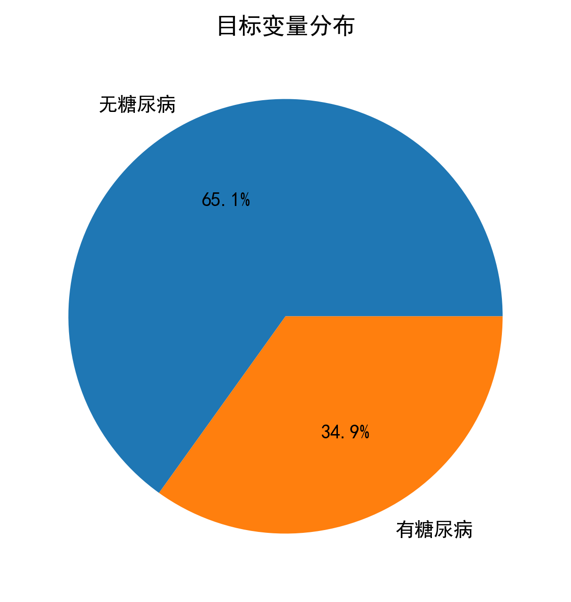
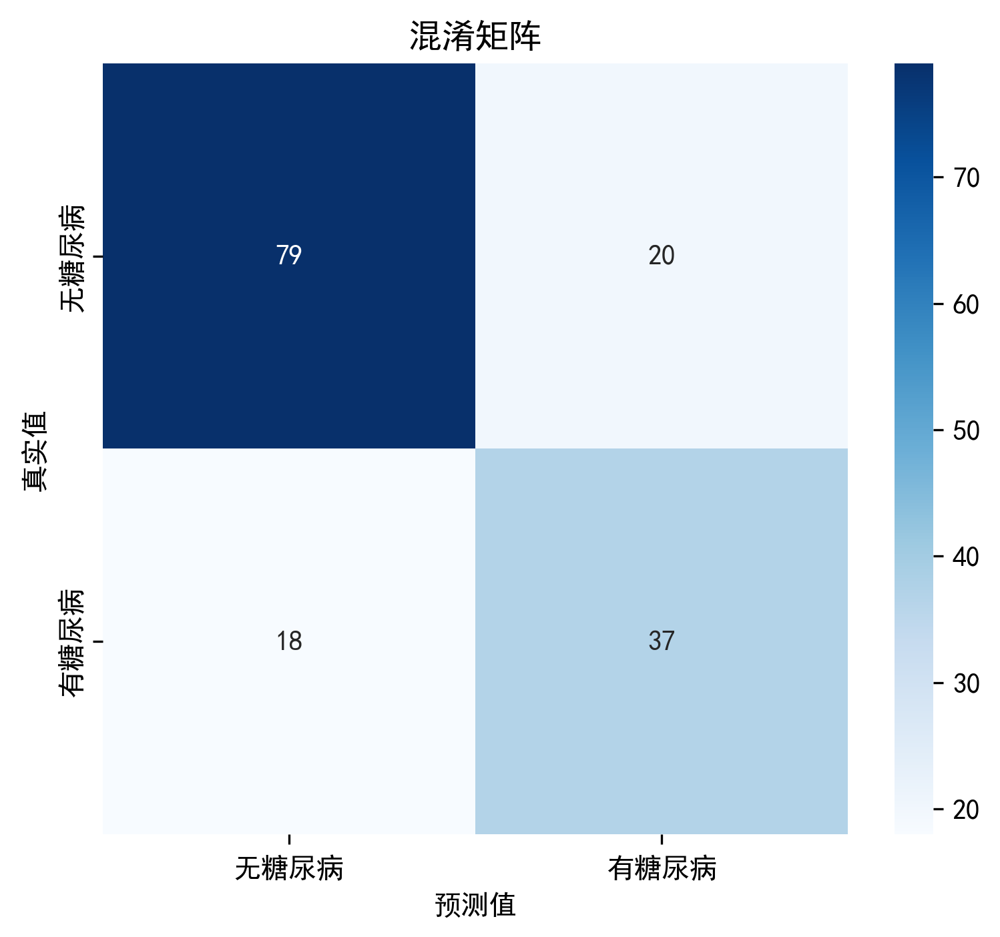

# 糖尿病风险预测分析

## 项目简介
本项目基于 Pima 印第安人糖尿病数据集，使用逻辑回归和 KNN 两种机器学习模型，根据患者的血糖、BMI、年龄等医学指标预测是否患有糖尿病。项目完整实现了数据清洗、探索性数据分析（EDA）、特征标准化、模型训练与评估，并结合医学知识对结果进行解读。

## 数据集
- 来源：[UCI Machine Learning Repository](https://raw.githubusercontent.com/jbrownlee/Datasets/master/pima-indians-diabetes.data.csv)
- 样本数：768 条
- 特征：怀孕次数、血糖、血压、皮褶厚度、胰岛素、BMI、糖尿病家族史、年龄
- 目标：是否患有糖尿病（0=否，1=是）

## 项目结构
- `diabetes_analysis.ipynb`：完整的 Jupyter Notebook 代码及分析过程
- `images/`：文件夹内包含所有生成的图表（饼图、箱线图、直方图、相关性热力图、混淆矩阵等）

## 主要结果
- **逻辑回归准确率**：76%
- **KNN 准确率**：74%
- **混淆矩阵（逻辑回归）**：[[79 20]
[18 37]]
解读：无糖尿病正确识别 79 人，误诊 20 人；有糖尿病正确识别 37 人，漏诊 18 人。
- **最重要的预测特征**：血糖、BMI、年龄（与临床认知一致）

## 可视化示例

> **📖 在线查看笔记本**：如果 GitHub 无法渲染，请点击 [这里](https://nbviewer.org/github/你的用户名/你的仓库名/blob/main/你的笔记本文件名.ipynb) 用 nbviewer 打开。

## 运行环境
- Python 3.8+
- 依赖库：pandas, scikit-learn, matplotlib, seaborn

## 如何运行
1. 克隆本仓库到本地
2. 安装依赖：`pip install pandas scikit-learn matplotlib seaborn`
3. 用 Jupyter Notebook 打开 `diabetes_analysis.ipynb`，按顺序运行所有单元格

## 作者
[你的名字]  
[GitHub 主页链接（可选）]

## 项目链接
[GitHub 仓库地址]
